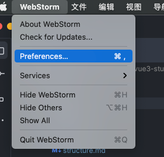
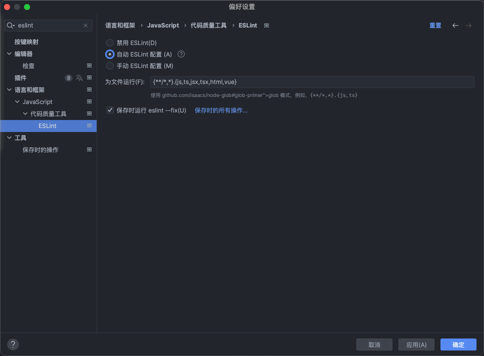
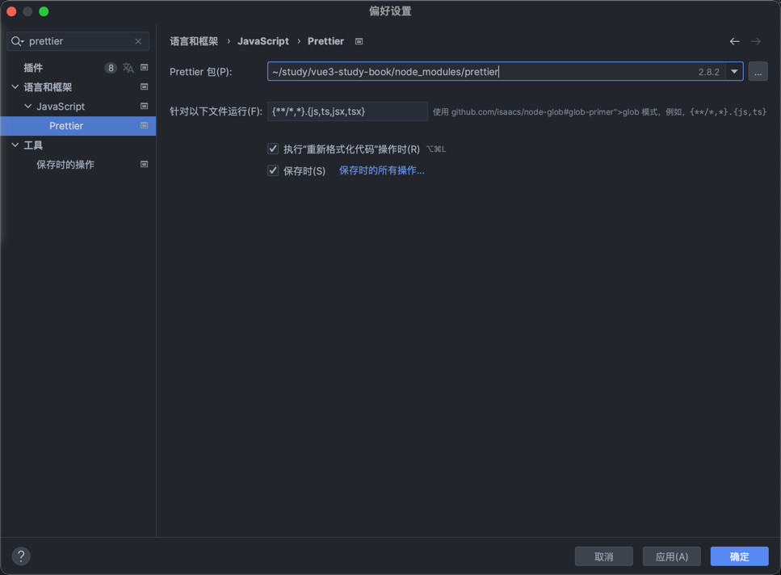

# 格式化配置

::: warning 你必须安装 Prettier 插件
在软件中安装`Prettier`插件并启用，同时需要设置`Prettier`为对应的代码默认格式化，或者将其设置为指定语言的代码格式化。
:::

::: warning 你必须安装 ESLint 插件
在软件中安装`ESLint`插件并启用，同时需要设置`ESLint`为对应的代码默认格式化，或者将其设置为指定语言的代码格式化。
:::
## Webstorm

1、打开设置

2、搜索eslint，勾选

3、搜索prettier，勾选





## Visual Studio Code

**在vsc中开启Eslint**

- 安装 `ESLint` 插件并启用

- `setting.json`中进行如下设置

```json
{
  "eslint.enable": true
}
```

**在vsc中开启Prettier**

- `setting.json`中进行如下设置

```json
{
  "editor.formatOnSave": true, // 开启保存文件自动格式化代码
  "editor.defaultFormatter": "esbenp.prettier-vscode", // 默认的代码格式化工具
  "prettier.requireConfig": true // 需要Prettier的配置文件
}
```

[参考地址](https://juejin.cn/post/7156893291726782500)
