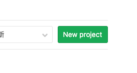
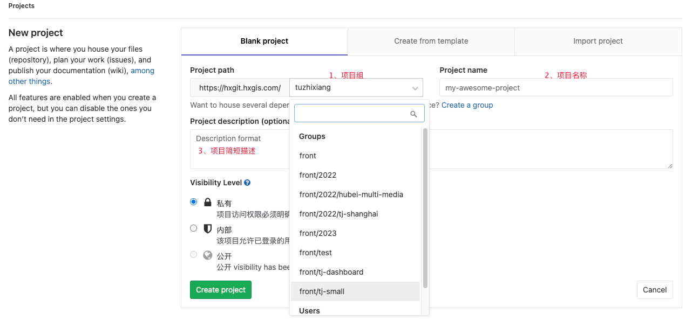
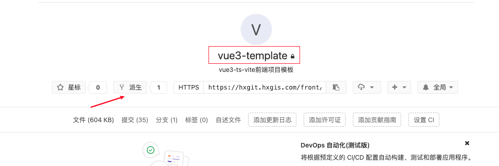
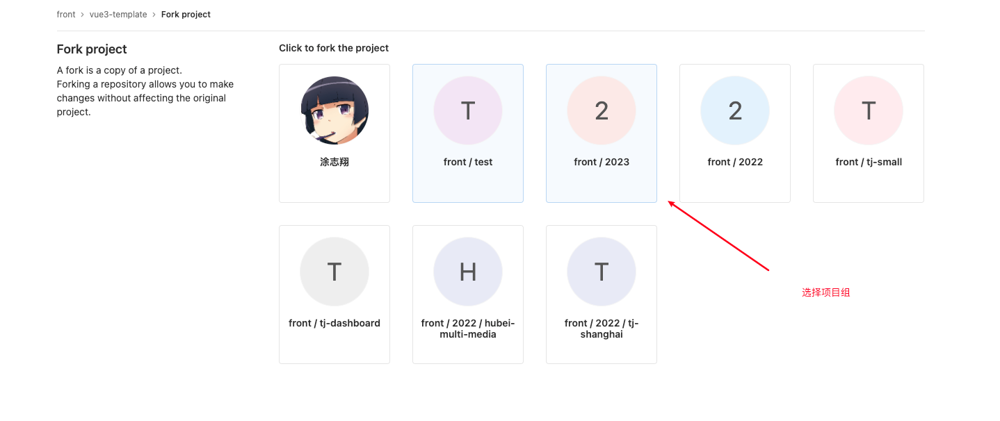
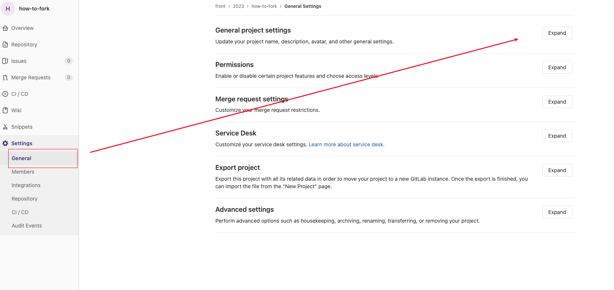
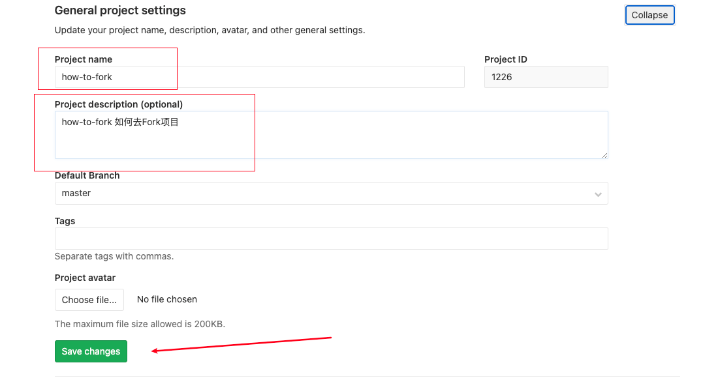
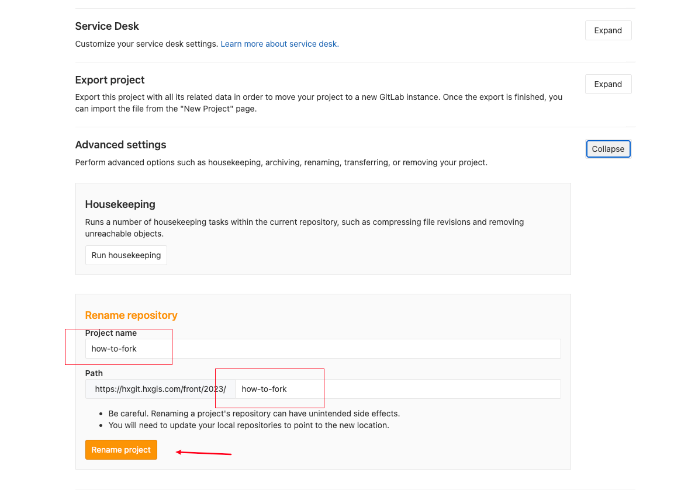

# 前端技术及结构手册

该手册适用于前端vue3项目模版

明确项目文件结构规范

## 安装与使用

### 创建项目地址（Git）

- 打开[GitLab](https://hxgit.hxgis.com/)

- 选择 --> New Project 
>我们建议`Fork`项目模版⬇️⬇️



- 填写相关信息

  1、选择产品组，`2023年`创建项目请选择 --> `2023项目组`

  2、项目名称（Project Name）请使用`串式命名法`

  还不知道什么是`串式命名法`🥴？[前往](./dev.md#文件及目录命名)

  3、项目简短描述




### Fork代码模板

:::: code-group
::: code-group-item 基础业务系统模版
```
https://hxgit.hxgis.com/front/vue3-template.git
```
:::
::: code-group-item 大屏模版
```
https://hxgit.hxgis.com/front/2022/Vue3_Big_Template
```
:::
::: code-group-item 三维模版
```
https://hxgit.hxgis.com/front/2022/vite-3d-template
（待完善）
```
:::
::::

### How To Fork ?





初始Fork项目为原项目名称，需要修改`项目基本详情`以及`Git`地址




你就可以`git clone [your new project path]`

### 安装依赖

:::: code-group
::: code-group-item NPM
```yaml
npm i
```
:::
::: code-group-item YARN
```yaml
yarn
```
:::
::: code-group-item PNPM
```yaml
pnpm i
```
:::
::::

### 格式化配置

[前往学习如何配置格式化 ➡️](./format.md)

### README

- 项目描述

  需要说明我们的项目名，项目功能简述，代码仓库地址，以及该项目的第一负责人。谁交接给我们的项目，谁就是该项目的第一负责人。
- 如何运行

  1. **开发环境配置**。一般是我们需要的一些运行环境配置。
  2. 开发&发布 命令。我们怎么通过命令开启本地开发，以及构建发布。
  3. 代理配置。如果我们的项目在本地开发时需要用到一些代理工具，例如fiddler或whistle等，我们需要列出代理的配置项。最好是直接导出一个代理配置的文件，放在项目下
  4. 发布。如果我们有用到一些发布平台，最好贴上项目的发布模块和发布单，减少我们发布的时间成本。
- 业务介绍

  各页面及描述 列出我们项目内的所有页面信息，比如下面这样：


| 项目目录       | 页面描述 | 页面路由       |
|------------|------|------------|
| error-page | 错误跳转 | 404/403/.. |
| redirect   | 重定向  | redirect   |
| home       | 首页   | /home      |
- 项目备注

  项目中需要告诉其他开发者一些关键信息，比如我们页面打包构建，需要注意哪些问题等等，这些信息虽然不是必须的，但是可以帮助其他开发者降低开发的风险成本。


## 技术框架

Vue3-Vite-TypeScript-Pinia-TailwindCss

### **Vue3**

Vue (发音为 **/vjuː/**，类似 view) 是一款用于构建用户界面的 JavaScript 框架。它基于标准 HTML、CSS 和 JavaScript
构建，并提供了一套声明式的、组件化的编程模型，帮助你高效地开发用户界面。无论是简单还是复杂的界面，Vue 都可以胜任。

[前往官网](https://cn.vuejs.org/)

[小知识阅读](/v3)

### **Vite**

版本（V2）,后续考虑升级V3

最低Node版本 👉 <Badge type="tip" text="14.18" vertical="middle" />

Vite（法语意为 "快速的"，发音 **/vit/**，发音同 "veet"）是一种新型前端构建工具，能够显著提升前端开发体验。

[前往官网](https://v2.vitejs.dev/)

### **TypeScript**

<span style="color: #f3a22b;font-size: 24px;">JavaScript的超集</span>

TypeScript是JavaScript类型的超集，它可以编译成纯JavaScript。

TypeScript可以在任何浏览器、任何计算机和任何操作系统上运行，并且是开源的。

[小知识阅读](/ts)

[前往官网](https://www.tslang.cn/)

### **Pinia**

Pinia（发音为 **/piːnjʌ/**，类似于英语中的“peenya”）是最接近有效包名 piña（西班牙语中的_pineapple_）的词。
菠萝实际上是一组单独的花朵，它们结合在一起形成多个水果。 与 Store 类似，每一家都是独立诞生的，但最终都是相互联系的。
它也是一种美味的热带水果，原产于南美洲。

[前往官网](https://pinia.web3doc.top/)

### **TailwindCss**

相对于**语义化类名**，原子化Css能够快速建立现代网站。

[前往官网](https://www.tailwindcss.cn/docs)

## 组件库

### Element-plus

基于 Vue 3，面向设计师和开发者的组件库


[前往官网](https://element-plus.org/zh-CN/)

### Leaflet

一个开源并且对移动端友好的 交互式地图 JavaScript 库


[中文网 由国内爱好者翻译](https://leafletjs.cn/)

[英文网](https://leafletjs.com/)

### Echarts

一个基于 JavaScript 的开源可视化图表库


[前往官网](https://echarts.apache.org/zh/index.html)

### VueUse

Vue功能丰富的Hooks组件库

[前往官网](https://vueuse.org/)

## 项目结构

```
--public
--src
  |--api
  |--assets
    |--css
    |--img
    |--json
    |--font
  |--components
  |--hooks
  |--i18n
  |--services
  |--store
  |--types
  |--util
  |--view
  App.vue
  auto-imports.d.ts
  components.d.ts
  config.json
  env.d.ts
  index.css
  main.ts
  permission.ts
  router.ts
.editorconfig
.env.development
.env.production
.eslintignore
.eslintrc.js
.gitignore
.prettierignore
.prettierrc
env.d.ts
image.d.ts
index.html
package.json
postcss.config.js
README.md
tailwind.config.js
tsconfig.json
tsconfig.node.json
vite.config.ts
```

## 项目结构描述

### public文件夹

> 静态资源文件，存放的文件不会经过vite处理，存放geojson或者第三方js插件

### src文件夹

> api 接口管理文件夹

1. 文件命名按照view模块命名，层级最多不超过2层，
2. 定义的接口函数（默认后端接口名称保持一致），如果接口名称不规范，前缀加模块名称
3. 参数type定义类型
4. 接口注释（默认与接口文档一致）

```ts
/**
 * 获取城市地址
 * @param params
 */
export const getOnceArea = (params: {
    cityCode: string
    dataType: string
    dataName: string
  }) =>
    tRequest.get({
      url: '/api/monitor/dataflow/getOnceArea',
      params,
    })

/**
 * 上传单张图片为ppt内容
 * @param data
 */
export const uploadImage = (data: { file: File }) => {
  return tRequest.post({
    url: '/ppt/pptModelConfigs/uploadImage',
    data,
  })
}
```

##### 接口参数

showLoading 全屏加载动画，默认为true
useCompress 压缩响应数据
useCompressWithCache 压缩并缓存响应数据

### assets文件夹

> 静态资源

1. 文件夹css、img、json、font等
2. img与json 存放位置按照view目录结构一一对应存放
3. 公共资源如预警图片单独在img根目录创建文件夹存放

### components

> 组件库

1.一个组件一个文件夹

2.组件需要的静态资源存放到文件夹下（例如img）

### hooks

> Hooks -> 钩子

- Hooks并不是全新的技术，它是一种开发思想，在hooks目录下新建模块->useXXX.ts
- 可以利用Hook函数 把相关代码剥离出去，减少冗余代码
- Hooks 函数以use开头（类似vue2 mixin $_XX_XX）小驼峰式命名：useFileHome
- 复用 **高内聚低耦合** 可塑性高

> 例一

```ts
import config from '../../config.json'

export const useStorage = new class {
  private readonly _localName: string;

  constructor(localName: string) {
    this._localName = localName
  }

  getStorage() {
    return JSON.parse(window.localStorage.getItem(this._localName)) || {}
  }

  setItem(key: string, val: any) {
    const storage = this.getStorage()
    storage[key] = val
    window.localStorage.setItem(this._localName, JSON.stringify(storage))
  }

  clearItem(key: string) {
    const storage = this.getStorage()
    delete storage[key]
    window.localStorage.setItem(this._localName, JSON.stringify(storage))
  }

  clearAll() {
    window.localStorage.clear()
  }
}(config.LocalName)
// const useStorage = new UseStorage
```

--> use

```typescript
import {useStorage} from '@/hooks'

useStorage.setItem('userinfo', data)
useStorage.clearAll()
```

> 例二

```typescript
import {computed, getCurrentInstance} from 'vue'
import type {ComputedRef} from 'vue'

export const useProp = <T>(name: string): ComputedRef<T | undefined> => {
  const vm = getCurrentInstance()!
  return computed(() => (vm.proxy?.$props as any)[name] ?? undefined)
}
```

--> use

```typescript
import {useProp} from '@/hooks'

const props = withDefaults(defineProps<{
  button: string
}>(), {
  button: ''
})
const button = useProp<string>('button')
```

更多工具hooks请访问 --> [VueUse](https://vueuse.org/)

### types目录

> ts类型定义

文件名称与view目录一致，目录结构不超过两层，按照路由目录创建

在其他项目中 import引入使用

typescript的目的是提升代码质量，提升可维护性

```typescript
export interface LoginType {
  username?: string,
  password?: string
}
```

::: danger 注意
:::

vue3 prop 暂不支持 外部引入type

> 错误示例

```ts
import type LoginType from '#/config'

const props = withDefaults(defineProps<LoginType>(), {
  username: '章三',
  passwoard: '123'
})

// or

const props = defineProps<LoginType>({
  username: '章三',
  passwoard: '123'
})

/**
 [@vue/compiler-sfc] type argument passed to defineProps() must be a literal type, or a reference to an interface or literal type.
 **/
```

> 正确示例

```typescript
interface LoginType {
  username?: string,
  password?: string
}

const props = withDefaults(defineProps<LoginType>(), {
  username: '章三',
  passwoard: '123'
})

// or

const props = withDefaults(defineProps<{
  username?: string,
  passwoard: string
}>(), {
  username: '章三',
  passwoard: '123'
})


// 注：请使用withDefaults来进行props传值
```

学习如何使用TypeScript? --> [TypeScript](https://www.tslang.cn/)

### store目录

> 原VueX 现使用Pinia

目录结构按照view目录创建

[知识点学习]()

[前往官网](https://pinia.web3doc.top/)


### i18n目录

> 国际化

>> 数据字典定义

数据字典按照页面模块划分（例如home\monitor2个模块）

```typescript
// 中文语言包：\src\i18n\lang\zh-cn.ts
export default {
  home: {
    name: '这是首页'
  },
  monitor: {
    name: '这是监测'
  }
}
// 英文语言包：\src\i18n\lang\en.ts
export default {
  home: {
    name: 'this is home'
  }
}
```

**使用**

```typescript
import { useI18n } from 'vue-i18n'// 要在js中使用国际化
const { t } = useI18n()
t('home.name')
```

**中英文切换**

```typescript
import i18n from '@/i18n'

i18n.locale = 'zhCn' //中文
i18n.locale = 'en' //英文
```

### view目录

> 用于存放所有的页面

1. 文件夹命名规范 串式命名 monitor-radar
2. 文件夹下index.vue以及子模块
3. index.vue dom模板创建

```vue
<template>
</template>

<script lang="ts" setup >

</script>

<style scoped lang="less" >

</style>
```

### router.ts

> 页面路由

  ```typescript
export const routeList: Array<RouteRecordRaw> = [
  {
    path: '/',
    redirect: '/home'
  }, {
    path: '/home',
    name: 'home',
    meta: {
      title: '首页'
    },
    component: () => import('./view/home/index.vue')
  }, {
    path: '/suntray',
    name: '控制台',
    component: () => import('@/view/control/index.vue'),
    redirect: '/suntray/my-apply',
    children: [
      {
        path: 'my-apply',
        name: '我的应用',
        component: () => import('@/view/control/my-apply/index.vue')
      },
      {
        path: 'my-service',
        name: '我的服务',
        component: () => import('@/view/control/my-service/index.vue')
      }
    ]
  },]
```
### .env.development与.env.production

开发环境与生产环境
使用全局变量
.env.development

```typescript
VITE_NODE_ENV = 'development'
VITE_APP_MAP_IP = ''
```

.env.production

```typescript
VITE_NODE_ENV = 'production'
VITE_APP_MAP_IP = '10.104.192.14'
```

->使用

```typescript
import.meta.env.VITE_APP_MAP_IP 
```

::: danger 注意
使用必须以 **VITE** 开头
:::

### vite.config.js

> 目前版本 <Badge type="tip" text="V2" vertical="middle" />

> [前往官网](https://v2.vitejs.dev/)

> [前往学习](https://v2.vitejs.dev/)

## 相关链接

[前往源配置](../util/npm.md)

[前端开发规范](./dev.md)

[组件通信](https://juejin.cn/post/7161718828970278949)

[Vue3知识点](../v3/preface.md)

