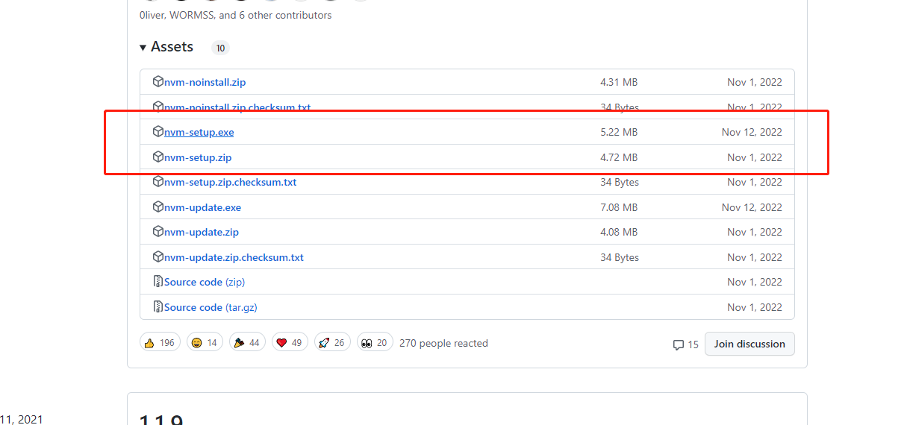
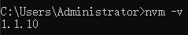
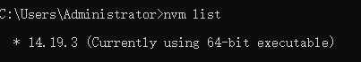
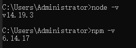
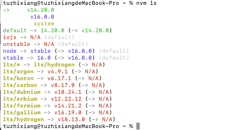

# NVM版本管理工具

日常开发中会经常遇到不同的项目，每个项目都有不同版本的`NodeJS`运行环境，把依赖升级最新的可能会产生很多问题。

`nvm`就是为了解决这个问题的，nvm是Mac下的node管理工具，类似Ruby的rvm。

## 在Mac上使用nvm

### 卸载全局安装的 node/npm

首先，打开Finder，按 `shift` + `command` + `G`，打开前往文件夹的窗口，分别输入下列目录进去删除`node` 和 `node_modules`相关的文件和文件夹。

或者，打开终端，输入命令
```shell
open /usr/local
```

- 打开`/usr/loacl/lib`，删除`node` 和 `node_modules`相关的文件和文件夹
- 打开`/usr/loacl/include`，删除`node` 和 `node_modules`相关的文件和文件夹
- 如果你是 `brew🍺` 下载的NodeJS，那么你需要在终端中执行 `brew uninstall node` 命令来卸载
- 检查 `/usr/local` 下所有的 `local` `lib` `include` 文件夹，删除`node` 和 `node_modules`相关的文件和文件夹
- 打开 `/usr/local/bin` 并删除 `node` 可执行文件

此外，你可能还需要在你的终端输入一些额外命名：
```shell
sudo rm /usr/local/bin/npm
sudo rm /usr/local/share/man/man1/node.1
sudo rm /usr/local/lib/dtrace/node.d
sudo rm -rf ~/.npm
sudo rm -rf ~/.node-gyp
sudo rm /opt/local/bin/node
sudo rm /opt/local/include/node
sudo rm -rf /opt/local/lib/node_modules
```

### 安装nvm
> brew🍺 安装

- 首先使用brew install nvm命令安装nvm；
```shell
brew install nvm
```
- 安装完成后brew会给出一些提示，根据提示，创建 .nvm 目录
```shell
mkdir ~/.nvm
```
- 编辑 ~/.zshrc 配置文件
```shell
vi ~/.zshrc
```
- 在 ~/.zshrc 配置文件后添加如下内容
```shell
export NVM_DIR="$HOME/.nvm"
 [ -s "/opt/homebrew/opt/nvm/nvm.sh" ] && . "/opt/homebrew/opt/nvm/nvm.sh" # This loads nvm
 [ -s "/opt/homebrew/opt/nvm/etc/bash_completion.d/nvm" ] && . "/opt/homebrew/opt/nvm/etc/bash_completion.d/nvm" # This loads nvm bash_completion
```
- 输入`:wq` 保存并退出, 使用 source 命令使配置生效
```shell
 source ~/.zshrc
```
- 查看是否生效
```shell
% echo $NVM_DIR
/Users/your-username/.nvm  #your-username
```

## 在Window上使用

### 测试电脑中是否安装了node

打开终端输入，输入命令 `node -v`，看到版本号，表示安装了node，则去卸载。

- 1.卸载`node`本身、删除`NodeJS`目录
- 2.手动删除在`C:\Users\用户名` 文件夹下 `.npmrc` 以及 `.yarnrc` 文件
- 3.环境变量中将`node`相关的也删除
- 4.最后用在终端输入用`node -v`测试是否卸载成功

### 安装nvm

- 1.打开官网下载最新版本的nvm：`https://github.com/coreybutler/nvm-windows/releases`



- 2.安装完成之后，打开终端输入，输入命令 `nvm -v`，看到版本号，表示安装成功。


### 安装node

- 1.通过命令安装: `nvm install` 版本号
- 2.查看node列表：`nvm list`
- 3.切换node版本：`nvm use` 版本号

  

  如果某个版本前面有 * 号，说明这个版本是你正在使用的版本
- 4.查看当前的node版本以及npm版本：node -v npm -v



## 安装多版本node/npm

> 当前Vue3支持最低版本 `14.19.0`

nvm 遵守语义化版本命名规则。例如，你想安装最新的 14.19 系列的最新的一个版本的话，可以运行：

```shell
nvm install 14.19
```

nvm 会寻找 14.19.x 中最高的版本来安装。

你可以通过以下命令来列出远程服务器上所有的可用版本：

```shell
nvm ls-remote
```

## 切换不同版本

每当我们安装了一个新版本 Node 后，全局环境会自动把这个新版本设置为默认。

nvm 提供了 `nvm use` 命令。这个命令的使用方法和 `install` 命令类似。

```shell
nvm use 14.19.0
# or 切换到最新版
nvm use node
```

我们还可以用 `nvm` 给不同的版本号设置别名：

```shell
nvm alias Latest-Vue3-version 14.19.0
# 取消别名
nvm unalias Latest-Vue3-version
```

## 列出已安装的node版本

```shell
nvm ls
```


`绿色箭头`是当前正在使用的版本


