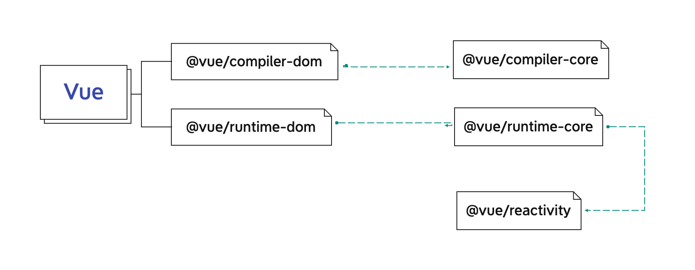

# 全局概括

## 目录结构
```javascript
├─.eslintrc.js // 格式化
├─.gitignore // git忽略文件
├─.prettierignore // prettier忽略文件
├─.prettierrc // prettier配置项
├─BACKERS.md
├─CHANGELOG.md // 更新日志
├─LICENSE
├─README.md
├─SECURITY.md
├─api-extractor.json // TypeScript 的API提取和分析工具
├─jest.config.js // 框架测试 jest 配置
├─netlify.toml
├─package.json
├─pnpm-lock.yaml
├─pnpm-workspace.yaml
├─rollup.config.mjs // 打包 rollup 配置文件
├─tsconfig.json // TypeScript 配置
├─test-dts // TypeScript 声明文件
├─scripts
└─packages // Vue3源码目录
```

重点在于 `package` 目录，该目录结构如下

```javascript
.
├── compiler-core // 平台无关的编译器（核心代码）
├── compiler-dom // 针对浏览器而写的编译器，用于编译dom实现
├── compiler-sfc // Vue单文件组件(.vue)的实现
├── compiler-ssr // ssr
├── global.d.ts
├── reactivity // 数据响应式系统，单独模块，可搭配任意框架
├── runtime-core // 与平台无关的运行时。其实现的功能有虚拟 DOM 渲染器、Vue 组件和 Vue 的各种API，我们可以利用这个 runtime 实现针对某个具体平台的高阶 runtime，比如自定义渲染器。
├── runtime-dom // 针对浏览器的 runtime。其功能包括处理原生 DOM API、DOM 事件和 DOM 属性等。
├── runtime-test // 一个专门为了测试而写的轻量级 runtime。由于这个 rumtime 「渲染」出的 DOM 树其实是一个 JS 对象，所以这个 runtime 可以用在所有 JS 环境里。你可以用它来测试渲染是否正确。它还可以用于序列化 DOM、触发 DOM 事件，以及记录某次更新中的 DOM 操作。
├── server-renderer // 服务端渲染实现
├── shared  // package 之间共享的工具库 内部方法
├── size-check
├── template-explorer
└── vue // 构造「完整构造」版本，引入了以上模块
```
### Runtime && CompileTime

该目录下最重要的模块有5个

- compiler-core
- compiler-dom
- runtime-core
- runtime-dom
- reactivity

`core` 和 `dom` 都出现了两次，其中区别为 `runtime` && `compiler`
> `Compiler` 主要是编译时间处理

`compiler-time` 指的是：我们写好源码在被编译成目标文件这段时间，`.vue`文件是不会被浏览器识别的，所以得转换成可以被识别的`.html`文件，那么这个时间段就是处理
源代码转换为最终可执行文件的这段时间。

> `Runtime` 主要是运行时间处理

`run-time` 指的是：程序正在运行时这段时间，包括你`打开程序` -> `运行` -> `程序关闭`这段时间的一系列处理

### 关系图如下



## createApp

### 初始化一个`Vue3`项目

```ts
import { createApp } from 'vue'
import App from './App.vue'

createApp.mount('#app')
```

### `createApp`是如何实现的

打开`createApp`源码，我们接着往下看

```ts{3,47}
// packges/runtime-dom/index.ts
export const createApp = ((...args) => {
  const app = ensureRenderer().createApp(...args)

  if (__DEV__) {
    injectNativeTagCheck(app)
    injectCompilerOptionsCheck(app)
  }

  const { mount } = app
  app.mount = (containerOrSelector: Element | ShadowRoot | string): any => {
    const container = normalizeContainer(containerOrSelector)
    if (!container) return

    const component = app._component
    if (!isFunction(component) && !component.render && !component.template) {
      // __UNSAFE__
      // Reason: potential execution of JS expressions in in-DOM template.
      // The user must make sure the in-DOM template is trusted. If it's
      // rendered by the server, the template should not contain any user data.
      component.template = container.innerHTML
      // 2.x compat check
      if (__COMPAT__ && __DEV__) {
        for (let i = 0; i < container.attributes.length; i++) {
          const attr = container.attributes[i]
          if (attr.name !== 'v-cloak' && /^(v-|:|@)/.test(attr.name)) {
            compatUtils.warnDeprecation(
              DeprecationTypes.GLOBAL_MOUNT_CONTAINER,
              null
            )
            break
          }
        }
      }
    }

    // clear content before mounting
    container.innerHTML = ''
    const proxy = mount(container, false, container instanceof SVGElement)
    if (container instanceof Element) {
      container.removeAttribute('v-cloak')
      container.setAttribute('data-v-app', '')
    }
    return proxy
  }

  return app
}) as CreateAppFunction<Element>
```

我们是可以发现的`createApp`返回了一个`app`实例，而这个实例是由`ensureRenderer()`创建的，那么重点就在于这个`ensureRenderer`链式函数执行完成后返回的

> `ensure` -> `确保`

> `render` -> `渲染`

> `renderer` -> `渲染器`

```ts
// packges/runtime-dom/index.ts
function ensureRenderer() {
  // 如果 renderer 有值的话，那么以后都不会初始化了
  return (
    renderer ||
    (renderer = createRenderer<Node, Element | ShadowRoot>(rendererOptions))
  )
}

// packges/shared/index.ts
export const extend = Object.assign
// packges/runtime-dom/index.ts
const rendererOptions = /*#__PURE__*/ extend({ patchProp }, nodeOps)

// renderOptions 包括以下函数
rendererOptions = {
  createElement,
  createText,
  setText,
  setElementText,
  patchProp,
  insert,
  remove,
}
```
再来看一下 `createRenderer` 返回的对象
```ts{21}
// packges/runtime-dom/renderer.ts
/**
 * createRenderer函数确保接收两个通用的参数：
 * HostNode和HostElement，分别对应与主机环境中的Node和Element类型。
 * 比如说，当你运行dom时，HostNode是 DOM `Node` 的接口
 * HostElement将是 DOM `Element` 的接口
 *
 * 自定义渲染器可以传平台的类型，就像下面：
 *
 * ``` js
 * const { render, createApp } = createRenderer<Node, Element>({
 *   patchProp,
 *   ...nodeOps
 * })
 * 
*/
export function createRenderer<
  HostNode = RendererNode,
  HostElement = RendererElement
>(options: RendererOptions<HostNode, HostElement>) {
  return baseCreateRenderer<HostNode, HostElement>(options)
}
```

紧接着调用 `baseCreateRenderer`，这个函数非常的大，足足有两千多行，我们只关注它的重点
```ts{29}
// packges/runtime-dom/renderer.ts
function baseCreateRenderer(
  options: RendererOptions,
  createHydrationFns?: typeof createHydrationFunctions
): any {
  /** xxx **/
  const {
    insert: hostInsert,
    remove: hostRemove,
    patchProp: hostPatchProp,
    createElement: hostCreateElement,
    createText: hostCreateText,
    createComment: hostCreateComment,
    setText: hostSetText,
    setElementText: hostSetElementText,
    parentNode: hostParentNode,
    nextSibling: hostNextSibling,
    setScopeId: hostSetScopeId = NOOP,
    insertStaticContent: hostInsertStaticContent
  } = options

  /**
   * 省略 2000+
   */

  return {
    render,
    hydrate,
    createApp: createAppAPI(render, hydrate)
  }
}
```

可以看到，`renderer` 对象上包含了 `createApp` 和 `render` 方法。再来看一下 `createApp` 方法：
```ts
// packages/runtime-core/apiCreateApp.ts
export function createAppAPI<HostElement>(
  render: RootRenderFunction<HostElement>,
  hydrate?: RootHydrateFunction
): CreateAppFunction<HostElement> {
  // createApp createApp 方法接收的两个参数：根组件的对象和 prop
  return function createApp(rootComponent, rootProps = null) {
    if (!isFunction(rootComponent)) {
      rootComponent = { ...rootComponent }
    }

    if (rootProps != null && !isObject(rootProps)) {
      __DEV__ && warn(`root props passed to app.mount() must be an object.`)
      rootProps = null
    }

    const context = createAppContext()
    const installedPlugins = new Set()

    let isMounted = false

    const app: App = (context.app = {
      _uid: uid++,
      _component: rootComponent as ConcreteComponent,
      _props: rootProps,
      _container: null,
      _context: context,
      _instance: null,

      version,

      get config() {
        return context.config
      },

      set config(v) {
        if (__DEV__) {
          warn(
            `app.config cannot be replaced. Modify individual options instead.`
          )
        }
      },

      use(plugin: Plugin, ...options: any[]) {},

      mixin(mixin: ComponentOptions) {},

      component(name: string, component?: Component): any {},

      directive(name: string, directive?: Directive) {},

      mount(
        rootContainer: HostElement,
        isHydrate?: boolean,
        isSVG?: boolean
      ): any {},

      unmount() {},

      provide(key, value) {}
    })

    if (__COMPAT__) {
      installAppCompatProperties(app, context, render)
    }

    return app
  }
}
```
你可以发现，在 `createApp` 对象中包含了 `use` `mixin` `mount` 等等方法

直到这里，我们才真正拨开了 `Vue 3` 初始化根组件的核心方法，也就是入口文件 `createApp` 真正执行的内容就是这里的 `createAppAPI` 函数中的 `createApp` 函数，该函数接收了 `<App />` 组件作为根组件 `rootComponent`，返回了一个包含 `mount` 方法的 `app` 对象。

## 创建根组件的 VNode

## VNode 渲染成真实的组件
